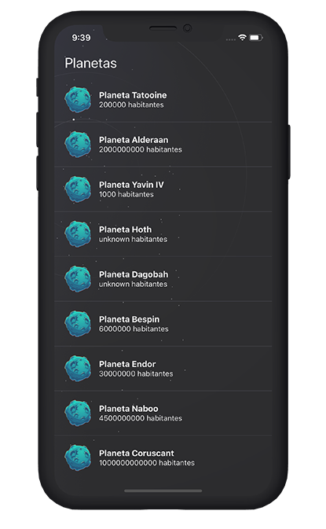
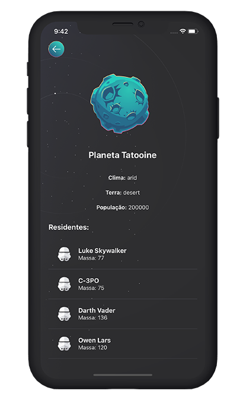

[](https://github.com/mateuslouback/App-Planets-Star-Wars/stargazers)
[](https://github.com/mateuslouback/App-Planets-Star-Wars/issues)
[](https://github.com/mateuslouback/App-Planets-Star-Wars/network)

<br />
<p align="center">
  

  <h2 align="center">App Planets Star Wars</h2>

  <p align="center">
    <strong>Sample application that lists the Star Wars planets.</strong>
    <br />
</p>

## Contents

- [About the Project](#about-the-project)
  - [Built With](#built-with)
- [Getting Started](#getting-started)
  - [Installation](#installation)
- [Screenshots](#screenshots)
- [Contact](#contact)

## About The Project

<p align="center">
  
</p>

This is a simple Star Wars planet listing project.
The project was made for the IOS and Android platforms through React Native with Expo.
<br />
<br />

### Built With

- [React-Native](https://github.com/facebook/react-native)
- [Expo](https://expo.io)
- [API Star Wars](https://swapi.dev/api/planets/)

## Getting Started

To get a local copy up and running follow these simple steps.

### Installation

2. Instal [Expo CLI](https://expo.io/learn)

```sh
npm install expo-cli --global
```

3. Clone the repo

```sh
git clone https://github.com/mateuslouback/App-Planets-Star-Wars.git
```

4. Install packages

```sh
yarn install
```

6. Run project on IOS or Android

```sh
yarn start
```

7. Read the QRCode with your phone's camera

## Screenshots

<p align="center">
  
  
</p>

## Contact

[Mateus Louback](https://mateuslouback.github.io) - [LinkedIn](https://www.linkedin.com/in/mateuslouback/)
